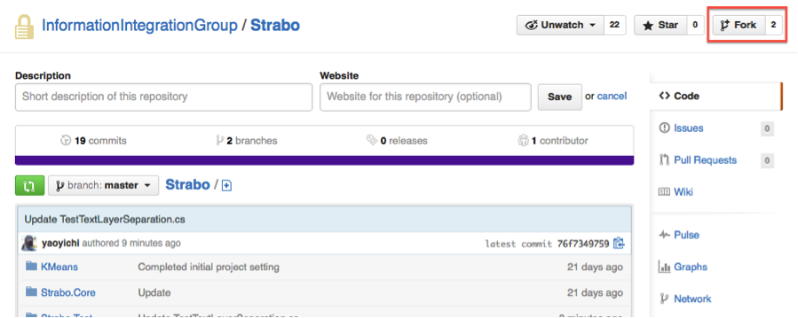
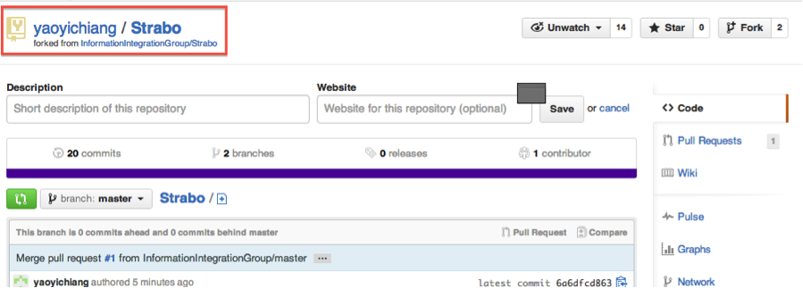
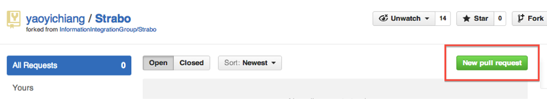

#GitHub Development Guide for Directed Research Developers

##Section 1. Project Setup
You are assigned to work on a project that requires you to submit your code to a GitHub repository. In this document, we use the InformationIntegrationGroup/Strabo repository as an example to show you how you should setup your source control environment using GitHub.

1. Fork the repository InformationIntegrationGroup/Strabo
 


2. Now you have your own copy of InformationIntegrationGroup/Strabo (called a fork). You should work on this fork. 
 

3. You will commit and push your code to your own fork regularly.

##Section 2. Update your fork with the original repository
Sometimes you will need to update your own fork with the original repository. Here are some examples:


1.	After you start developing on your fork for one month (during which you regularly push your code to your own fork), you want to push your code to the original repository (**InformationIntegrationGroup/Strabo**). Before you can push your code, you should update your fork and resolve any merge conflict.
2.	Someone who also works on **InformationIntegrationGroup/Strabo** has wrote a class that you want to use or test, you want to have that class in your own fork.

Here’s what you should do to update your own fork (Credit: <http://www.youtube.com/watch?v=bTaFAqJ6bjE>)

1.	Open your fork on GitHub.
2.	Click on "Pull Requests".
3.	Click on "**New Pull Request**". By default, GitHub will compare the original with your fork, and there shouldn't be anything to compare if you didn't make any changes.
4.	Click on "**switching the base**". Now GitHub will compare your fork with the original, and you should see all the latest changes.
5.	Click on "**Click to create a pull request for this comparison" and assign a predictable name to your pull request (e.g., "Update from original**").
6.	Click on "**Send pull request**".
7.	Scroll down and click "**Merge pull request**" and finally "**Confirm merge**". If your fork didn't have any changes, you will be able to merge it automatically. 

##Section 3. Check-in: send your updates (in your fork) to the original repository
After you update your fork with the original repository, you can create a pull request to notify the administrator that you want to merge your code (in your fork) to the original repository. Note that if you have not update your fork (section 2) before you submit a pull request, your pull request will be ignored if there exists any conflict between your fork and the original repository. 

##Section 4. What you should check in
1.	People who check in also check in instructions on how to install and run the code
2.	The repository should contain a sample dataset to run the code
3.	All installs should be using maven (this is for JAVA projects only)
4.	Before you check in, you should ask one of the other fellows to run the code and test that it works. You can ask them to fork your repository, download the repository, and run on their machine. You should write down the name of the person who tested your code in the comment section of the pull request.
